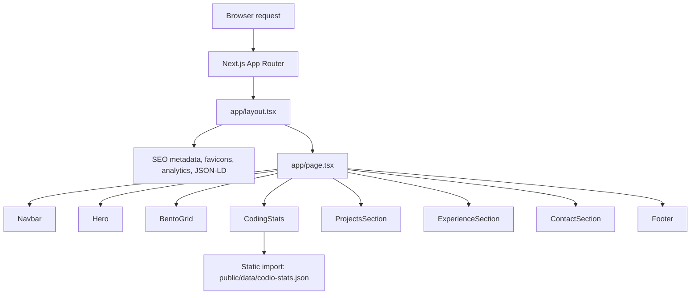
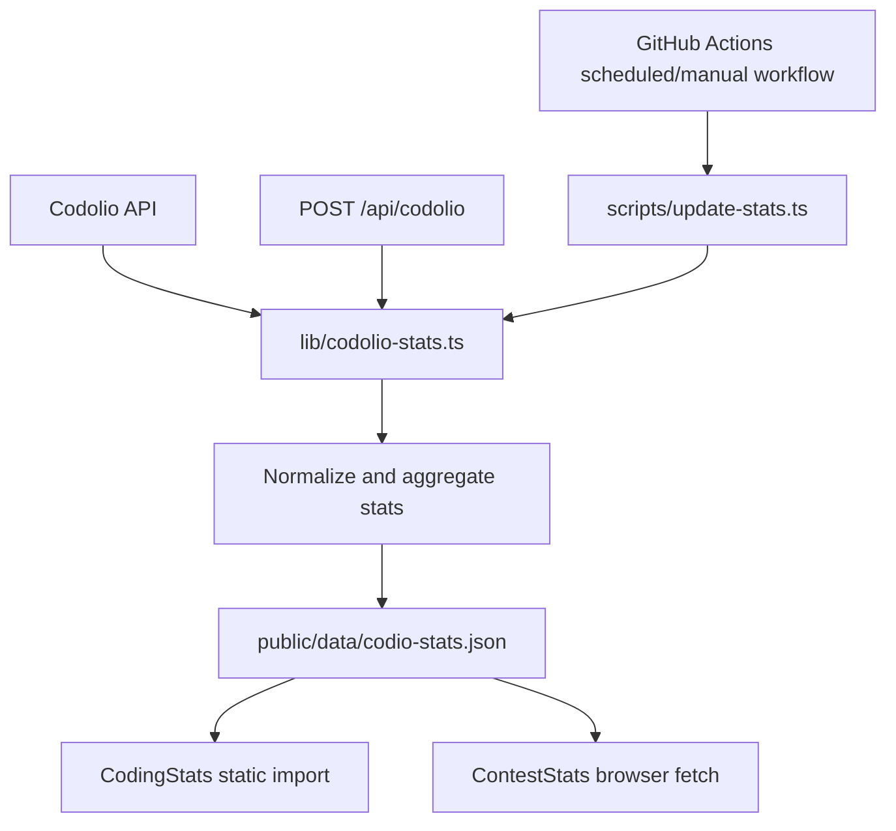
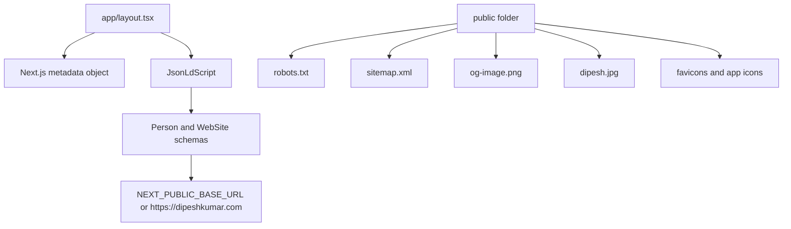
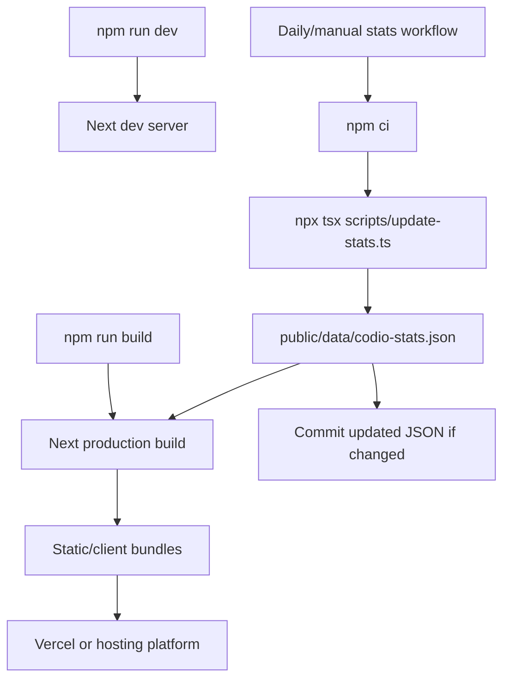

# Portfolio Site Workflow Map

This project is a single-page Next.js App Router portfolio. Most visible content is static React component data. The only dynamic application data is the Codolio-powered coding statistics cache in `public/data/codio-stats.json`.

## High-Level Runtime Flow



## Page Composition

`app/page.tsx` renders one long `<main>` with sections in this order:

1. `Navbar`
2. `Hero`
3. `BentoGrid`
4. `CodingStats`
5. `ProjectsSection`
6. `ExperienceSection`
7. `ContactSection`
8. `Footer`

The section IDs are used for same-page navigation:

| Section | ID | Rendered by |
| --- | --- | --- |
| Top | `#top` | `Hero` |
| About | `#about` | `BentoGrid` |
| Coding stats | `#coding-stats` | `CodingStats` |
| Projects | `#projects` | `ProjectsSection` |
| Experience | `#experience` | `ExperienceSection` |
| Contact | `#contact` | `ContactSection` |

## APIs And Network Calls

### Internal API

| Route | Method | Caller | Purpose |
| --- | --- | --- | --- |
| `/api/codolio` | `GET` | Manual/debug use; not used by the current homepage render | Return cached stats from `public/data/codio-stats.json`; if missing, fetch live Codolio stats; if that fails, return fallback stats |
| `/api/codolio` | `POST` | Manual/local refresh or automation | Fetch fresh Codolio stats and overwrite `public/data/codio-stats.json` |

`POST /api/codolio` can be protected with `CODOLIO_CRON_SECRET`. When that environment variable exists, the request must include:

```http
Authorization: Bearer <CODOLIO_CRON_SECRET>
```

### External APIs

All external stats calls are centralized in `lib/codolio-stats.ts`.

Base URL:

```text
https://api.codolio.com
```

Endpoints hit in parallel by `fetchCodolioSiteStats(userKey)`:

| Endpoint | Required | Used for |
| --- | --- | --- |
| `GET https://api.codolio.com/user/details?userKey=<user>` | Yes | Codolio card totals: total questions solved and total active days |
| `GET https://api.codolio.com/profile?userKey=<user>` | Yes | Platform profiles, difficulty counts, topic distribution, badges, submission calendars, GFG/HackerRank totals |
| `GET https://api.codolio.com/github/profile?userKey=<user>` | No, optional fallback to zeroes | GitHub stats as synced by Codolio: stars, commits, contributions, PRs, issues, active days |

The app does not call the public GitHub API directly. GitHub numbers come through Codolio.

### Static Browser Fetch

`ContestStats` performs:

```ts
fetch("/data/codio-stats.json")
```

This fetches the public JSON file from the Next.js static assets layer in the browser.

## Stats Data Refresh Flow



### Aggregation Logic

`fetchCodolioSiteStats` transforms Codolio responses into this local shape:

```ts
{
  totalQuestions,
  totalActiveDays,
  submissions,
  maxStreak,
  currentStreak,
  awards,
  dsa: { total, easy, medium, hard, other },
  fundamentals: { total, gfg, hackerrank },
  topics,
  github,
  contest,
  lastUpdated
}
```

Important details:

| Field | How it is produced |
| --- | --- |
| `totalQuestions` | `codolioCardDetails.totalQuestionsSolved` from `/user/details` |
| `totalActiveDays` | `codolioCardDetails.totalActiveDays` from `/user/details` |
| `dsa.easy`, `medium`, `hard` | Summed across all `platformProfiles` from `/profile` |
| `dsa.other` | `cardTotalQuestions - easy - medium - hard`, clamped at zero |
| `fundamentals.gfg` | GeeksforGeeks `totalQuestionCounts` |
| `fundamentals.hackerrank` | HackerRank `totalQuestionCounts` |
| `contest` | Aggregated from Codolio platform `userStats` and `contestActivityStats.contestActivityList` |
| `submissions` | Sum of merged platform submission calendars |
| `maxStreak` | Longest consecutive-day run in merged calendars |
| `currentStreak` | Most recent consecutive-day run in merged calendars |
| `awards` | Count of badges across platforms |
| `topics` | Topic counts merged across platforms, sorted descending, top 6 |
| `github` | `/github/profile`, with missing/failed request treated as zeroed values |
| `lastUpdated` | Current ISO timestamp when stats are refreshed |

The current checked-in cache is `public/data/codio-stats.json`, last updated at `2026-05-29T08:54:21.885Z`.

## Rendering Data Flow

### `CodingStats`

`components/stats.tsx` is a client component, but it imports the stats JSON statically:

```ts
import statsData from "@/public/data/codio-stats.json";
```

Render behavior:

- No runtime API request.
- No loading state.
- Values are bundled from the JSON file at build time.
- Uses Framer Motion and viewport detection for counters, circular progress, topic bars, and stat cards.
- Uses a generated client-side activity heatmap for presentation; it is not a real per-day Codolio heatmap.

Contest data is rendered inside `CodingStats`, so the homepage no longer performs a separate browser fetch for contest numbers.

### Other Sections

| Component | Data source | Rendering behavior |
| --- | --- | --- |
| `Navbar` | Local arrays and `/dipesh.jpg` | Fixed top nav, scroll-aware background, mobile menu, smooth scrolling |
| `Hero` | Local text/link arrays | Client animation sequence, mouse parallax, profile/social/resume links |
| `BentoGrid` | Local arrays and `/dipesh.jpg` | About cards, skills, featured projects, education, animated tech cube |
| `TechCube` | Local `techStack` object | CSS 3D cube controlled by Framer Motion and mouse movement |
| `ProjectsSection` | Local project array | GitHub project cards |
| `ExperienceSection` | Local experience, education, leadership arrays | Timeline and cards |
| `ContactSection` | Static contact links | Email, LinkedIn, GitHub, Codolio links |
| `Footer` | Local social link array | Social links and copyright year |

## SEO And Static Assets



SEO-related behavior:

- `JsonLdScript` injects Person and WebSite schema as a single JSON-LD `@graph`.
- `NEXT_PUBLIC_BASE_URL` defaults to `https://dipeshkumar.com`.
- `robots.txt` disallows `/api/`.
- `sitemap.xml` points to the production homepage and OG image.
- `next.config.mjs` enables image optimization formats, compression, strict mode, ETags, and disables `x-powered-by`.

## Environment Variables

| Variable | Used in | Default | Purpose |
| --- | --- | --- | --- |
| `CODOLIO_USER_KEY` | `lib/codolio-stats.ts`, `scripts/update-stats.ts` | `dipesh4000` | Codolio user key used in API URLs |
| `CODOLIO_CRON_SECRET` | `app/api/codolio/route.ts` | unset | Optional bearer-token protection for `POST /api/codolio` |
| `NEXT_PUBLIC_BASE_URL` | `components/json-ld-script.tsx`, metadata per architecture notes | `https://dipeshkumar.com` | Canonical/public site URL |
| `GOOGLE_SITE_VERIFICATION` | metadata per architecture notes | unset | Google Search Console verification |

## Build And Deployment Flow



Because `CodingStats` statically imports the JSON file, fresh stats normally need to be written before the production build to appear in that component. `ContestStats` can pick up the public JSON at runtime when the deployed static file changes.

## External Links

The site links out to:

| Destination | Used for |
| --- | --- |
| `https://github.com/dipesh4000` | Main GitHub profile |
| GitHub project URLs | Project cards in About and Projects |
| `https://linkedin.com/in/dipesh4000` | Social/contact links |
| `https://kaggle.com/dipesh4000` | Footer social link |
| `https://x.com/dipesh4000` | Footer social link |
| `https://codolio.com/profile/dipesh4000` | Coding/contact profile link |
| `https://leetcode.com/u/dipesh4000/` | Coding profile link |
| OneDrive resume URL | Resume view/download links |
| `mailto:dipeshkumar0853822@gmail.com` | Hire/contact email links |

## Key Observations

- The homepage does not call `/api/codolio` during normal rendering.
- `CodingStats` renders DSA, GitHub, and contest data from the same static JSON import.
- Contest data now comes from the Codolio profile response instead of being manually maintained in the JSON file.
- Runtime writes to `public/data/codio-stats.json` via `POST /api/codolio` work locally, but on many serverless deployments those writes are not persistent. The durable production path is the stats update script/workflow committing the JSON file.
